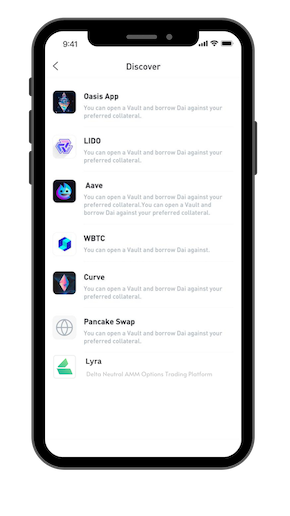
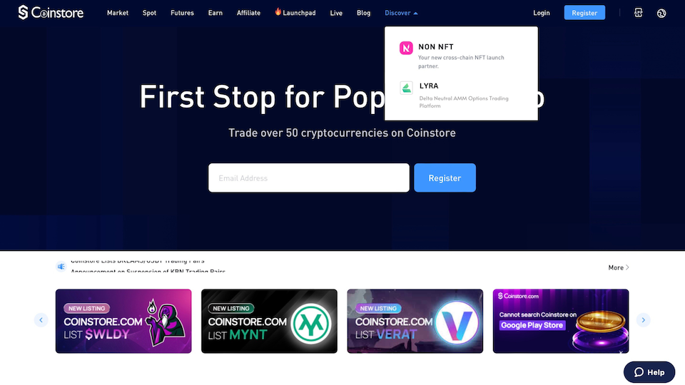

<!--You can leave these HTML comments in your merged LEAP and delete the visible duplicate text guides, they will not appear and may be helpful to refer to if you edit it again. This is the suggested template for new LEAPs. Note that a LEAP number will be assigned by an editor. When opening a pull request to submit your LEAP, please use an abbreviated title in the filename, `leap-draft_title_abbrev.md`. The title should be 44 characters or less.-->

## Simple Summary
<!--"If you can't explain it simply, you don't understand it well enough." Simply describe the outcome the proposed changes intends to achieve. This should be non-technical and accessible to a casual community member.-->

The passing of this proposal will allow Coinstore to host Lyra's frontend on Coinstore's centralised exchange. This is will be the first true integration between DeFi and CeFi, Coinstore will be working closely with Lyra in regards with the integration of the proposed fork.  
  
## Abstract
<!--A short (~200 word) description of the proposed change, the abstract should clearly describe the proposed change. This is what *will* be done if the LEAP is implemented, not *why* it should be done or *how* it will be done. If the LEAP proposes deploying a new contract, write, "we propose to deploy a new contract that will do x".-->
We propose to fork and self-host Lyra's most up to date and stable open source UI/UX for a 3 year period, if one is not available then a fork of a prefered interface will be hosted instead. Lyra will be featured on Coinstore's discover page as "Lyra Finance". We are requesting 170,000 $LYRA pre-deployment and 5% reward per trade with a max cap of 3,000,000 $LYRA once fork is live. The terms of this agreement should be reviewed and evaluated in May 2023, if terms are to be amended a subsequent LEAP will be deployed.    

## Motivation
<!--This is the problem statement. This is the *why* of the LEAP. It should clearly explain *why* the current state of the protocol is inadequate.  It is critical that you explain *why* the change is needed, if the LEAP proposes changing how something is calculated, you must address *why* the current calculation is innaccurate or wrong. This is not the place to describe how the LEAP will address the issue!-->

Since the crash of FTX, many people lost total trust in CEXs with Binance showing outflows of up to 12.5B in as little as 30days. Likewise as a CEX, we noticed the shift of funds to custody wallets however we were mistaked. It wasn't just CEXs that they were lost in trust in, it was about losing trust with the regulators, licenses and governments. The FTX crash may have made this industry fall back a couple of years but I think it showed the people even the regulated, licensed, government-backed entities can fall. The choice was obvious, transparency is much more desired now. Therefore it's time for DeFi to shine, it's made by the masses, for the masses. 

As for the UI/UX hosting with Coinstore, I believe the value and target audience are non-natives with Coinstore to bridge, Lyra's community to Educate. We will be working towards our shared goal of DeFi adoption and it’s definitely going to be a long and tough road ahead. However, me, my team and Coinstore are ready to commit to a long term partnerhship, I believe our ultimate goal is about targeting non-natives with our end game being mass adoption. 

## Specification
<!--The specification should describe the syntax and semantics of any new feature, there are five sections
1. Overview
2. Rationale
3. Technical Specification
4. Test Cases
5. Configurable Values
-->

### Overview
<!--This is a high level overview of *how* the LEAP will solve the problem. The overview should clearly describe how the new feature will be implemented.-->

This partnerhhip would mean Lyra will be exposed to a new stream of users and Coinstore to the DeFi community. I believe the success of this LEAP will start the first of many LEAPs we will be working even closer with the implementation of Lyra's UI/UX. With Lyra's UI/UX being live, we will be launching our DeFi academy as well in support of Lyra. This is where users unfamiliar with DeFi are able to understand, this way we can facilitate and welcome new users of DeFi, beginning with Lyra. 

Coinstore currently has 2.3 to 2.4 (KYC) million users, mainily in the SEA region. Peak daily VOL @ ~630M (2022),  minimum daily VOL 20M (2022), Current daily VOL ~144M. Ranked #21 on CG, #77 on CMC. (Accurate at time of writing)

### Rationale
<!--This is where you explain the reasoning behind how you propose to solve the problem. Why did you propose to implement the change in this way, what were the considerations and trade-offs. The rationale fleshes out what motivated the design and why particular design decisions were made. It should describe alternate designs that were considered and related work. The rationale may also provide evidence of consensus within the community, and should discuss important objections or concerns raised during discussion.-->

### Technical Specification
<!--The technical specification should outline the public API of the changes proposed. That is, changes to any of the interfaces Lyra currently exposes or the creations of new ones.-->

1) Coinstore to host latest stable interface fork of Lyra. 
2) If not available, a prefered fork will be hosted.
3) Lyra's team to provide support for the duration of the partnership.
4) UI hosted as Lyra Finance.
5) Rewards Model to be revaluated in May 2023.
6) Address : 0x1390e61Ac63c56e80649bD1405AdC6E3D4a069ad
7) Part of the inital $LYRA incentives will be liquidated, remainder to be staked.
8) Preview for Lyra feature : 

 

### Test Cases
<!--Test cases for an implementation are mandatory for LEAPs but can be included with the implementation..-->
  
### Configurable Values
<!--Please list all values configurable under this implementation.-->

Hosting period : 3 Years Extendable.
Incentives for hosting: 170,000 $LYRA.
Rewards per trade : 5% Capped at 300,000 $LYRA. (To be reviewed in May 2023)
Coinstore traders : Fees rebates from $stkLYRA. 

## Copyright
Copyright and related rights waived via [CC0](https://creativecommons.org/publicdomain/zero/1.0/)
