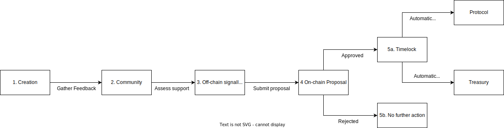
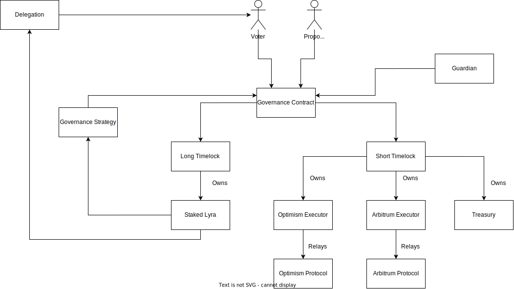

## Simple Summary

The next iteration of Lyra Governance.

## Abstract

This LEAP proposes migrating Lyra Governance from [v1](https://leaps.lyra.finance/leaps/leap-15), a representative council model with off-chain voting, to v2, a fully autonomous on-chain system. This allows token holders to directly govern the components of the DAO which require human input, specifically:

1. Protocol Administration
2. Treasury Management
3. Staked LYRA

In this system, proposals are fully on-chain, binding and auto-execute without reliance on any third party. It also works cross-chain, allowing token holders to govern deployments and treasuries on multiple networks. If approved, the following actions would occur:

1. Disband the Lyra Council.
2. Deploy Lyra Governance V2 - an on-chain system described in section 3.
3. Transfer ownership of Lyra DAO’s treasuries and protocol contracts to Lyra Governance.

## Motivation

## Governance and Tokens

Governance is [required](https://fehrsam.xyz/blog/governance-minimization) for the aspects of a protocol that require human input (i.e. things that cannot be automated). There are two main areas of any project that require such input:

1. Protocol Administration
    1. Deployment of smart contracts
    2. Setting system parameters
2. Treasury Management
    1. Funding the maintenance and improvement of the protocol

The need for a governance framework that can manage a protocol and treasury has led to [several](https://vitalik.ca/general/2017/12/17/voting.html) experiments, with governance tokens proving the most effective. Tokens align the different stakeholders in a project toward a common goal (although not without significant [drawbacks](https://vitalik.ca/general/2021/08/16/voting3.html), i.e. [plutocracy](https://vitalik.ca/general/2018/03/28/plutocracy.html)).

## Governance V1 and Tradeoffs

Lyra Governance V1 is a system for governing the DAO via a governance token known as LYRA. It was introduced in [LEAP-15](https://leaps.lyra.finance/leaps/leap-15) and is centred around a 5 seat representative council known as the Lyra Council. Token holders elect the council, which administers the [LEAP framework](https://leaps.lyra.finance/). A LEAP is a proposal to change part of the protocol and can be created by anyone in the community. 

The council model offers great speed and flexibility, allowing the project to evolve rapidly. In 18 months, we approved over 40 LEAPs, launching the [protocol](https://leaps.lyra.finance/leaps/leap-2), [token](https://leaps.lyra.finance/leaps/leap-8), [two](https://leaps.lyra.finance/leaps/leap-16) [major](https://leaps.lyra.finance/leaps/leap-18) [upgrades](https://leaps.lyra.finance/leaps/leap-36) (Avalon and [Newport](https://leaps.lyra.finance/leaps/leap-38)) and many [others](https://leaps.lyra.finance/all-leap). However, the speed afforded by the council model comes at a cost.  Proposals are off-chain, which introduces implementation risk that affects both the protocol and the treasury. This serves to undermine the dependability of the project.

## Becoming Dependable

With the recent launch of Newport, we have a protocol that can be deployed on any EVM-compatible network and integrated with any perpetual venue for hedging. This is a foundation on which we can attract legitimate institutions to build on the protocol, provide liquidity and trade. However, they need a governance process that they can depend on. We intend this iteration of Lyra Governance to be a meaningful step on the path of progressive decentralisation.

## Specification

## Overview

Lyra Governance V2 allows LYRA holders to directly govern the protocol and treasury via an on-chain system. By staking the LYRA token, holders receive a governance token, stkLYRA, with governance rights that enable them to make proposals, vote or delegate to other token holders. Proposals are called LEAPS, which are fully on-chain, binding and execute automatically, without any reliance on a third party. Cross-chain governance is supported, allowing the management of multiple protocol deployments and treasuries on different networks. 

In this overview, we provide a non-technical description of the governance framework.

### Token Rights

LYRA token holders can stake their LYRA to receive stkLYRA, which grants governance powers proportionally to their balance. There are initially two powers associated with the stkLYRA token:

1. **Proposal right** - gives access to creating a proposal.
2. **Voting right** - enables voting on existing proposals.

### Delegation

Users can choose to delegate one or both of these rights. This enables Lyra Governance to retain the benefits of a council-based model, where less informed participants can delegate to others, without introducing the implementation risks currently associated with the off-chain council model.

### Lyra Enhancement Action Proposals (LEAPs)

A LEAP is any proposal that impacts the protocol, treasury or governance framework. It has been adapted from industry standard frameworks, such as [EIP](https://eips.ethereum.org/) and [BIP](https://github.com/bitcoin/bips/blob/master/bip-0001.mediawiki). Examples may include protocol changes (listing new markets and changing parameters), treasury actions (allocating LYRA tokens and remunerating contributors) as well as meta-governance updates (changing the governance process itself).

#### LEAP Structure ####

Each LEAP must include the following:

- Simple Summary - A simplified and layman-accessible explanation of the LEAP.
- Abstract - A short description of the LEAP.
- Motivation - Why the existing system is inadequate to address the problem that the LEAP solves.
- Specification - The specification should describe the process and structure of the proposal.
- Rationale - Why were particular design decisions made? Describe alternate designs that were considered and related work.
- Test Cases - Test cases are required for code-related proposals (i.e. non treasury actions).
- Copyright Waiver - All LEAPs must be in the public domain. See the bottom of this LEAP for an example copyright waiver.

#### LEAP Life Cycle ####

1. Creation - The author(s) write the LEAP using the specified template.
2. Community - The LEAP is published to the community.
3. Off-chain signalling (optional) - The LEAP is proposed on snapshot (current system) for stkLYRA holders to signal approval or dismissal.
4. On-chain proposal - The LEAP is submitted to the Lyra Governance system, to be voted on by stkLYRA holders.
5. Execution
    1. Approval - If the LEAP is approved, the payload is sent to the relevant timelock for automatic execution.
    2. Rejected - If the LEAP is rejected, there is no further action.

### Treasury ###

In this system, Lyra Governance will take ownership of all treasury assets currently held in the multisig safes on Ethereum, Optimism and Arbitrum. This means that any movement of DAO funds will require a proposal to be passed. Any group can make a proposal to governance for funding. This may include the current core contributors and/or any other third party who wishes to work on the protocol.

### Protocol ###

Lyra Governance V2 makes the protocol significantly more dependable, in part because it increases the time taken for a change to be made. This is desirable when it comes to decisions such as deploying new smart contracts, launching a new market or introducing a new incentive program. However, with respect to protocol performance and safety, responsiveness is critical.

Consider the following scenario - a bug discovered in the smart contract code that results in an active exploit. The community needs to be able to act fast to ensure that any loss of assets is kept to a minimum. In the governance system, a proposal would need to be voted on, approved and executed, which would take days at best. In addition, there are many complex parameters that occasionally require swift updates to respond to market conditions.

#### Governance Wrapper ####

For safety and performance reasons, we are proposing the idea of a risk council and governance wrapper. Token holders will elect the council and set the bounds of the parameters which can be changed. This means this council will not be able to set parameters to a level where exploitation is possible, but they will be able to:

1. Pause the protocol in an emergency, with only token holders able to resume it.
2. Modify parameters within bounds, allowing for better performance of the protocol.

This idea will be expanded upon in a subsequent LEAP and until implemented, protocol contracts will not be transferred to Lyra Governance.

## Rationale ##

### On-chain vs Off-chain Governance ###

Off-chain governance allows faster decision-making and improves the speed of iteration. However, it relies on third parties to implement proposals, which undermines the dependability of the project. Early-stage projects often choose off-chain governance to begin with and as the project matures, they transition to on-chain governance.

### Frameworks ###

The two most popular types of on-chain governance frameworks are:

1. Compound Governance - most battle-tested but needs a special ERC20Votes token
2. Open Zeppelin Governor - most generic but doesn’t work easily with stkLYRA

Aave governance has a very similar structure and workflow to both of these systems but has the added benefit of working natively with the staked LYRA token (which was forked from Aave’s staked token). While it hasn’t been deployed across as many projects, it has secured Aave’s multi-billion dollar TVL for over 2 years, providing a considerable degree of confidence in it’s implementation.

## Technical Specification ##

At a technical level, Lyra Governance is very similar to [Aave Governance v2](https://github.com/aave/governance-v2). It shares the same high-level components and source code, with minor adjustments:

1. Governance Contract
    1. Handles the proposal life cycle
2. Governance Strategy Contract
    1. Determines the strategy used to calculate voting power
3. Timelock Contracts
    1. Short - Handles execution of protocol + treasury proposals
    2. Long - Handles  execution of stkLYRA + meta governance proposals 
4. Actors
    1. Proposers - Initiate the proposal process
    2. Voter - Vote on active proposals

In the diagram below, we visualise the architecture of these components: 

### Governance Contract
The governance contract is responsible for administering the proposal process. It has five steps:

#### 1. Creation ####

A proposal can be created by calling the `create()` function. The caller must have a proposer power greater than the threshold and they must maintain it until the proposal is executed. After the proposal is created it assumes the `PENDING` state until the vote begins.

#### 2. Voting ####

Voting begins after the `votingDelay` has elapsed, a value which can be read from `getVotingDelay()`. At this point, a snapshot of voting powers is taken and can no longer be delegated/transferred for the proposal being voted on. The proposal state is `ACTIVE` and users can submit a vote for or against the proposal, weighted by the user's total voting power (tokens + delegated voting power), within the allotted `[VOTING_DURATION]`.

#### 3. End of Voting ####

For a proposal to pass the voting power of for-votes needs to reach the quorum set by the `[MINIMUM_QUORUM]` parameter. In addition, the difference between for-votes and against-votes (in % of total voting power) needs to exceed the vote differential threshold set by the `[VOTE_DIFFERENTIAL]` parameter. If the proposal has passed, then the proposal state becomes `SUCCEEDED`, otherwise, it is `FAILED`.

#### 4. Queuing and execution ####

A `SUCCEEDED` proposal can be queued and will be executed after the execution delay and before the grace period expiration. The `delay` can be fetched from `getDelay()` and the `GRACE_PERIOD` can be fetched from `GRACE_PERIOD()`.

The validation and execution of the proposal are performed by the time lock executor. A queued proposal state is `QUEUED.` A successfully executed proposal state is `EXECUTED`. If a queued proposal has not been executed before expiration, then the proposal state is `EXPIRED`.

#### 5. Proposal Canceling ####

If the proposal creator's proposal power decrease and no longer meet the `PROPOSITION_THRESHOLD`, any user can cancel the proposal. In addition as an initial safeguard to the protocol, the **guardian** account, controlled by a community multisig, is able to cancel a proposal before a proposal is executed. A cancelled proposal state is `CANCELED`.

### Governance Strategy

The Governance Strategy is responsible for determining how voting power is calculated.

### Timelocks

The timelock contracts are responsible for automatically executing approved proposals.

#### Short-time lock executor ####

The short-time lock executor can change the following parts of Lyra:

- Protocol Deployments
    - Optimism
    - Arbitrum
- Treasuries
    - Optimism
    - Arbitrum
    - Mainnet

#### Long-time lock executor ####

The long-time lock executor can change the following parts of the Lyra protocol:

- Staked LYRA
- Governance System

### Cross-chain

The cross-chain bridge executors extend Lyra Governance on Ethereum to other networks.

### Migration

In order to migrate from V1 governance, the following actions need to occur:

#### Deploy Lyra governance V2 ####

1. Deploy the governance system on Ethereum L1

#### Ownership of treasury ####

1. Transfer assets from Ethereum DAO Multisig to Short Executor
2. Transfer assets from Optimism DAO Multisig to Optimism Executor
3. Transfer assets from Arbitrum DAO Multisig to Arbitrum Exectuor

#### Ownership of protocol ####

1. Transfer ownership of Optimism Protocol to Optimism Executor
2. Transfer ownership of Arbitrum Protocol to Arbitrum Executor
3. Governance Wrapper and Risk Council

# Test Cases

Test cases are included with the implementation and are available [here](https://github.com/lyra-finance/governance/tree/master/test).

# Configurable Values

## Governance

- Voting Delay: 7200 blocks (approx 1 day with 12s blocks)
- Guardian: Lyra Guardian Multisig
- Executors Whitelisted: Long and Short
- Owner: Long Executor

## Executor (short)

- Admin: Lyra Governance V2
- Voting Delay: 1 day
- Grace Period: 5 days
- Proposition Threshold: 0.5%
- Voting Duration: 3 days
- Vote differential: 0.5%
- Quorum: 4%

## Executor (long)

- Admin: Lyra Governance V2
- Voting Delay: 7 days
- Grace Period: 5 days
- Proposition Threshold: 2%
- Voting Duration: 10 days
- Vote differential: 15%
- Quorum: 20%

## Copyright
Copyright and related rights waived via [CC0](https://creativecommons.org/publicdomain/zero/1.0/).
